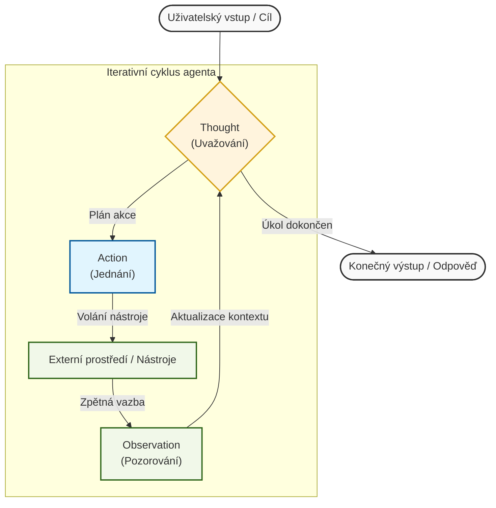

# Obecný koncept ReAct Loop

```mermaid
graph TD
    %% Definice stylů pro čistý vzhled
    classDef startEnd fill:#f9f9f9,stroke:#333,stroke-width:2px;
    classDef logic fill:#fff4dd,stroke:#d4a017,stroke-width:2px;
    classDef exec fill:#e1f5fe,stroke:#01579b,stroke-width:2px;
    classDef env fill:#f1f8e9,stroke:#33691e,stroke-width:2px;

    %% Diagram
    Input([Uživatelský vstup / Cíl]) --> Thought

    subgraph Iterativni_Smycka ["Iterativní cyklus agenta"]
        Thought{"Thought<br/>(Uvažování)"} -- "Plán akce" --> Action["Action<br/>(Jednání)"]
        Action -- "Volání nástroje" --> External["Externí prostředí / Nástroje"]
        External -- "Zpětná vazba" --> Obs["Observation<br/>(Pozorování)"]
        Obs -- "Aktualizace kontextu" --> Thought
    end

    Thought -- "Úkol dokončen" --> Output([Konečný výstup / Odpověď])

    %% Přiřazení stylů
    class Input,Output startEnd;
    class Thought logic;
    class Action exec;
    class External,Obs env;
```
